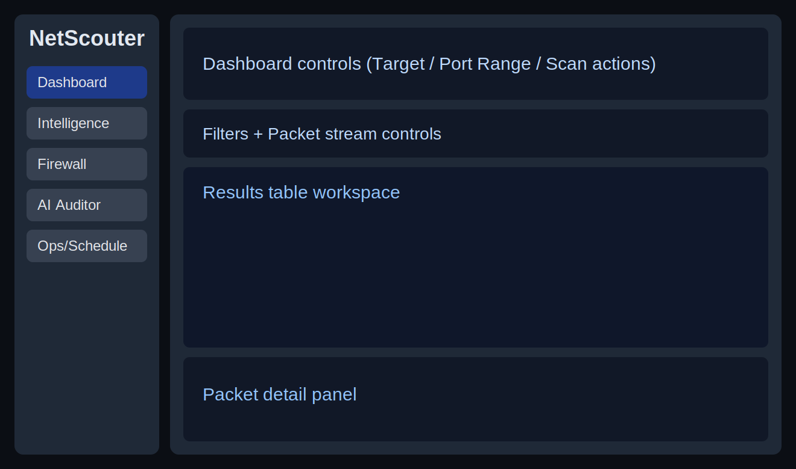

# NetScouter

NetScouter is a Python desktop app scaffold for network scanning, intel enrichment, firewall integration, exports, and scheduled scans.

## Updated architecture

```text
netscouter/
  __init__.py
  main.py
  gui/
    app.py              # Top navigation shell + panes (Dashboard/Intel/AI/Ops)
  scanner/
  intel/
  firewall/
  alerts/
    voice.py            # Voice alerts with pluggable TTS backends + severity thresholds
    remote.py           # Remote /BLOCK channel + secure command authorization
  export/
  scheduler/
pyproject.toml
README.md
assets/screenshots/
```

### GUI redesign summary

- `NetScouterApp` now uses a **horizontal top bar** to switch panes:
  - Dashboard
  - Intelligence (includes firewall operations)
  - AI Auditor
  - Ops/Schedule
- The workspace swaps pane content while preserving shared state and logs.
- App launch now starts maximized for large-monitor workflows.

### Alerting and remote response

- `netscouter.alerts.voice.VoiceAlertService`
  - Accepts any backend implementing `speak(text)`.
  - Enforces severity thresholds (`INFO`, `LOW`, `MEDIUM`, `HIGH`, `CRITICAL`).
- `netscouter.alerts.remote.RemoteActionChannel`
  - Supports mobile-triggered command flows such as `/BLOCK <ip>`.
  - Includes shared-secret HMAC signatures, sender allowlist, timestamp windows, and nonce replay protection.

## Redesigned layout asset



## Prerequisites

- Python 3.10+
- `pip`

## Install

### Windows (PowerShell)

```powershell
py -3.10 -m venv .venv
.\.venv\Scripts\Activate.ps1
python -m pip install --upgrade pip
pip install -e .
```

### Linux (bash)

```bash
python3 -m venv .venv
source .venv/bin/activate
python -m pip install --upgrade pip
pip install -e .
```

### macOS (zsh/bash)

```bash
python3 -m venv .venv
source .venv/bin/activate
python -m pip install --upgrade pip
pip install -e .
```

## Run

From the repository root (with virtual environment active):

```bash
python -m netscouter.main
```

## Dependencies

Defined in `pyproject.toml`:

- customtkinter
- psutil
- requests
- pandas
- apscheduler
- matplotlib
- scapy

### Live packet stream quick usage

1. Choose a stream scope in Dashboard: **Selected Row**, **Target Host**, or **Local Network**.
2. For row scope, select one or multiple rows in the table; right-click for quick actions.
3. Click **Start Live Packet Stream**.
4. Read updates in the packet detail panel and in **Dashboard > Packet Stream** log tab (direction IN/OUT, source/destination, PID when available).
5. Use **Export packet slice** for JSON evidence capture (host scope or full local-network scope).
6. Use **Show/Hide Local Info** to refresh+toggle local IP visibility and **Clear Scan Logs** to wipe table rows/logs.

### VirusTotal API key guidance

- For this app, use a standard **VirusTotal API v3 key** from your VirusTotal account profile.
- A personal/community key works for testing and light usage, but has tighter rate limits.
- For heavier automation and higher throughput, use a paid/enterprise key.
- Paste the key into the **Intelligence > VirusTotal key** field, then click **Apply Settings**.

If the stream does not start, run with elevated privileges and ensure packet-capture drivers are present:
- Windows: run shell as Administrator and install Npcap.
- Linux/macOS: run with sudo or grant packet capabilities.


### Ops automation and LAN monitor

- **Conditional Automations** (Ops/Schedule): optional auto-response for repeated high-risk activity.
  - Toggle **Enable auto-response** on/off.
  - Set high-risk hit threshold.
  - Choose action (`quarantine` or `banish`).
- **LAN Device Monitor** (Ops/Schedule): discover local devices, inspect IoT anomalies, and trigger per-device containment actions.


### About packet "decryption" and full OSI visibility

- NetScouter can inspect packet metadata and unencrypted payload context when capture privileges are available.
- Decrypting encrypted traffic (TLS/HTTPS/VPN) in transit is generally not feasible without endpoint keys, controlled proxies, or enterprise MITM infrastructure.
- Full OSI decoding is possible for visible headers (L2-L4 and parts of L7), but encrypted application payloads remain opaque by design.

## Live packet streaming permissions

NetScouter can stream packets live with Scapy. Raw packet sniffing generally requires elevated privileges:

- **Linux/macOS:** run the app with `sudo`, or grant packet-capture capabilities to your Python runtime (`CAP_NET_RAW` / `CAP_NET_ADMIN`).
- **Windows:** run the app from an Administrator shell (Npcap/WinPcap recommended for capture support).

Without elevated permissions, packet stream start may fail with permission errors.
